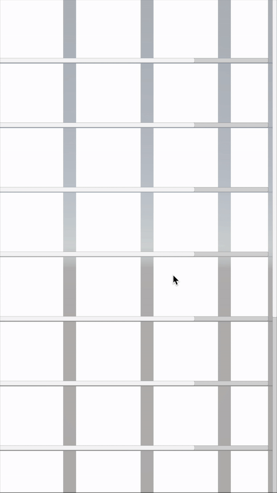

# Nested Scroll Rect (AdvancedScrollRect)

## Overview



Nested Scroll Rect is a utility that allows you to easily nest multiple `ScrollRect` components within each other (e.g., a vertical scroll containing horizontal scrolls) and correctly forward drag events either to the child or to the parent `ScrollRect`, depending on the drag direction.

When a parent `ScrollRect` and a child `ScrollRect` are both present, a typical issue is that the child intercepts all drag events, preventing the parent from scrolling if the user drags in the parent’s scroll direction. Nested Scroll Rect solves this by forwarding drag events to the parent when appropriate.

## Installation

### 1. Git or Package Manager

1. Clone or download this repository.
2. In your Unity project, open **Package Manager**.
3. Click the `+` button in the upper-left corner, select **Add package from disk...**, and browse to the `Packages/AdvancedScrollRect` folder in the cloned repository.
4. Click **Add** to install.

Alternatively, you can add this repository as a Git URL:

1. Open **Package Manager**.
2. Click the `+` button, select **Add package from git URL...**.
3. Paste the repository URL: `https://github.com/kwan3854/Nested-Scroll-Rect.git?path=/Packages/AdvancedScrollRect`
4. Click **Add**.

### 2. OpenUPM

This package is also available on OpenUPM under the name `com.kwanjoong.nestedscrollrect`.

To install via OpenUPM, simply run:

```
openupm add com.kwanjoong.nestedscrollrect
```

## Repository & Sample

This repository contains a sample project. To try it out:

1. Clone this repository.
2. Open the Unity project in the folder.
3. Look for the sample scenes to see how nested scrolls work.

## Usage

### 1. Setting up in the Editor

1. Create a parent `ScrollRect` (for example, a vertical scroll) in your scene.
2. Under that parent, create a child `ScrollRect` and add the `NestedScrollRect` component (for example, a horizontal scroll).
3. In the Inspector of your `NestedScrollRect`, assign the parent `ScrollRect`to the Parent Scroll Rect field.
   - Alternatively, click the button to automatically find the nearest parent `ScrollRect`.

### 2. Dynamic / Runtime Instantiation

If you instantiate the child `NestedScrollRect` at runtime under a parent `ScrollRect`, it will automatically find and assign the closest parent scroll rect.

- This saves you from having to manually specify the parent.
- However, note that searching for the parent does have a small performance overhead.

## License

This project is licensed under the [MIT License](https://github.com/kwan3854/Nested-Scroll-Rect/blob/main/LICENSE).
